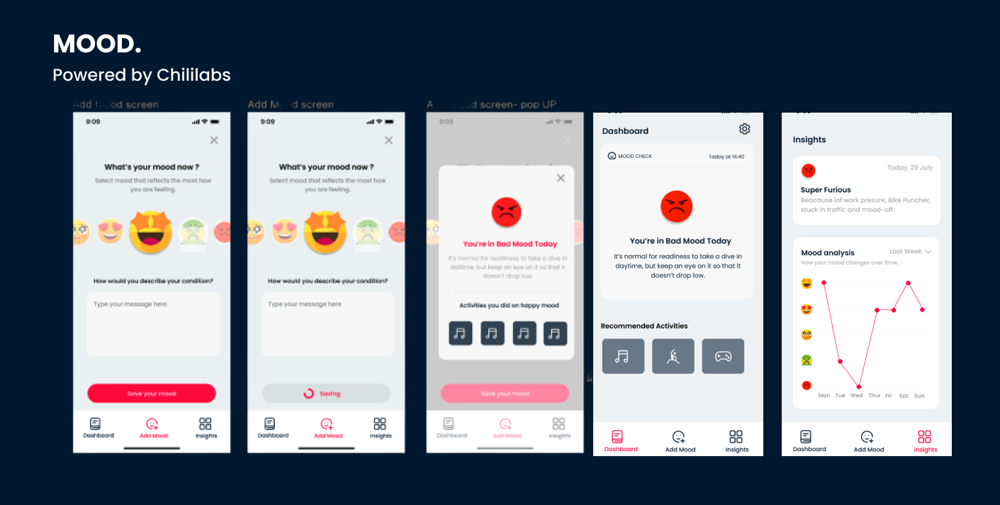

# Mood 



## Description

Mood  is a user-friendly mobile application designed to help users log their moods at different times of the day and gain insights into their emotional well-being. It provides an intuitive interface for mood logging, trend analysis, reminders, and mood-related tips. Users can easily track their moods, view mood trends over days, weeks, and months, set reminders to log their moods, and receive helpful tips to improve their mood based on their mood history.

## Tech Stacks

The Mood Tracking App is built using the following technologies:

- [FlutterFlow](https://www.flutterflow.com/): A low-code platform for building beautiful and functional Flutter apps.
- [Firebase](https://firebase.google.com/): A comprehensive suite of cloud-based tools and services for app development.
- [Flutter](https://github.com/): 
- [Figma](https://flutter.dev/): 

## Features

- Google Authentication
- Apple Sign In
- Email Sign In
- Add Mood Tracking
- Motivation Quote for getting started with improving user's mood
- Mood Insights over a variety of user specified timelines
- Daily Reminders to log user Mood using FCM Notifications
- Localization 
- DarkTheme/LightTheme Accessibility
- etc.


## Resources

- Technical Design  Documentation TDD [link](https://docs.google.com/document/d/1UnZw8JjVdg00MxnqAt2d1OpaleeaR-YhvM51AU_Gv6w/edit?usp=sharing)
- User Stories Document [link](https://docs.google.com/document/d/1t4eTSwdqMvu-IHw96VNeDEIrqZL4nd0zQSqqm2Q3DwM/edit?usp=sharing)
- User Interface Design [link](https://www.figma.com/file/6TwOCq1xC3EhS9BWvsipJF/Mood?type=design&node-id=145%3A2314&mode=design&t=sH4nW22iz04REufD-1)
## Local Development

To run the Mood Tracking App locally on your machine, follow the steps below:

### Prerequisites

- [Flutter SDK](https://flutter.dev/docs/get-started/install) installed on your machine.
- Emulator or real device setup for Android and/or iOS.

### Running the App on Emulator

1. Clone the repository to your local machine:

```
git clone https://github.com/isaacpitwa/mood.git
```

2. Change the directory to the project:

```
cd mood
```

3. Ensure you have a running emulator or device configured.

4. Launch the app on the emulator/device:

```
flutter run
```

### Running the App on Real Device (Android)

1. Enable Developer Mode on your Android device.

2. Connect your device to your computer via USB.

3. Trust the computer on your device if prompted.

4. Change the directory to the project:

```
cd mood
```

5. Run the app on your connected Android device:

```
flutter run
```

### Running the App on Real Device (iOS)

1. Ensure you have Xcode installed on your macOS system.

2. Connect your iOS device to your Mac via USB.

3. Trust the computer on your device if prompted.

4. Change the directory to the project:

```
cd mood
```

5. Run the app on your connected iOS device:

```
flutter run
```

## Developer Information

The Mood Tracking App is developed by Isaac Pitwa Nyonyintono.

- GitHub: [@isaacpitwa](https://github.com/isaacpitwa)
- LinkedIn: [Isaac Pitwa](https://www.linkedin.com/in/isaac-pitwa)
- Twitter:  [@isaacpitwa](https://twitter.com/IsaacPitwa)
- Email: [isaacpitwanyonyintono@gmail.com]

## License

The Mood Tracking App is released under the [MIT License](LICENSE).

---
Thank you for using the Mood! If you have any questions or feedback, please feel free to reach out to us. Happy mood tracking!
